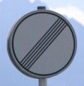

## Writeup

**Traffic Sign Classifer Project**

In this project, we create a CNN Deep Learning model based on LeNet architecture to classify [43 german traffic signs](signnames.csv).

Training, validation and test code: 
[Traffic_Sign_Classifier.ipynb](Traffic_Sign_Classifier.ipynb) / 
[Traffic_Sign_Classifier_final.html](Traffic_Sign_Classifier_final.html)

<b>Dataset Exploration</b>

[Training, validation and test datasets](https://s3-us-west-1.amazonaws.com/udacity-selfdrivingcar/traffic-signs-data.zip)

Summary of data sets:
- Number of training examples = 34799
- Number of validation examples = 4410
- Number of testing examples = 12630
- Image data shape = (32, 32, 3)
- Number of classes = 43

The above image shows the number of samples per class in the training dataset. The sample distribution is unbalanced and this can lead to a biased model. 

<b>Augmenting Training Samples</b>

To increase variability of training samples, new synthetic training samples are added. <b>Number of samples added per class such that the samples distribution is more balanced.</b>

Here is a summary of training sample augmentation:
- Warp 80% of newly added images using 4 different warp matrices.
    - This will ensure images taken at an angle are classified better.
- Scale images to 85% / 110% / 125%
    - This enables better classification of zoomed in or zoomed out images.
- Rotate image by -5 degrees / 0 degrees / 5 degrees

<b>Preprocessing</b>
- The images are scaled (0 to 1) and converted to grayscale. Model trained on color images with 3 channels did not provide better performance and the training time was slower.

<b>Model Architecture</b>
- The model architecture is based on LeNet.
    - Input: 32x32x1 (Grayscale image)
    - 8 Convolution 5x5 - 1x1 stride, valid padding, outputs 28x28x8 
    - RELU
    - Dropout 30%
    - Max pooling - 2x2 stride, outputs 14x14x8
    - 20 Convolution 5x5 - 1x1 stride, valid padding, outputs 10x10x20 
    - RELU
    - Dropout 30%
    - Max pooling - 2x2 stride, outputs 5x5x20
    - Flatten - outputs 500
    - Fully connected - outputs 160
    - RELU
    - Dropout 30%
    - Fully connected - outputs 120
    - RELU
    - Dropout 30%
    - Fully connected - outputs 43

<b>Model Training</b>
- Here are final values used for training after trying out various values for these parameters
    - Learnong rate: 0.002
        - Lower rate resulted in slower learning without improvement in maximum accuracy. Higher rate resulted in faster training and lower maximum accuracy.
    - Optimizer: Adam
    - Number of epochs: 50 (with early stopping after 10 epochs)
        - Both training and validation accuracy increase rapidly upto 20 epochs and then plateau around 40 epochs. Early stopping was setup to stop after 10 epochs without improvement but this condition was not met for the final model trained. See image below.
    - Batch size: 512
        - <b>Chose this number to have approx. 10 samples per class per batch. Having fewer samples may result in unbalanced classes and a learning that is not stable</b>

<b>Solution</b>
- The final solution obtained using the above architecture has an accuracies below
    - <b>Training (w dropout): 98.0%</b>
    - <b>Validation (w dropout):  94.0%</b>
    - <b>Training (w/o dropout): 97.6%</b>
    - <b>Test (w/o dropout): 95.0%</b>

<b>Testing model on images from the web</b>
- Here are 11 images downloaded from the internet to test the model on.

The model predicted with an accuracy of 100%. Below is a summary of the predictions.

<b>Softmax probabilities of test images from the web</b>
- Below are softmax probabilities for the test images from the web. It can be noticed that most images have the max probability almost at 100%. This is probably due to the images being very clear and without any distortion. Second 80km/h speed limit image has 17% confusion with 60km/h which is understandable. 

<b>Discussion</b>
- Increasing model size and adding more synthetic samples could increase the accuracy further.